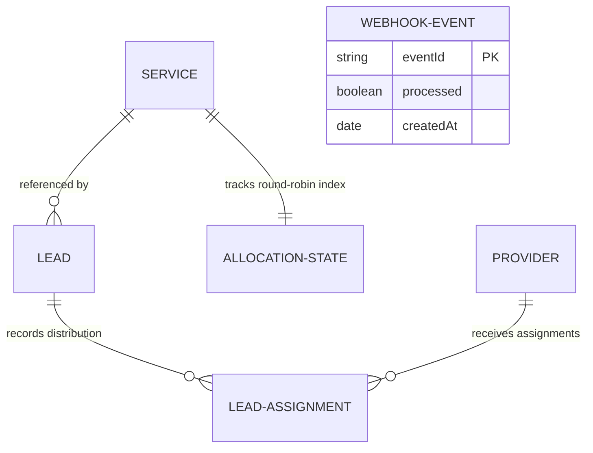

# Prowider Mini: Lead Distribution System

A production-style Full Stack lead generation and distribution engine designed with strict backend correctness, concurrency safety, persistent fair allocation, and real-time dashboard telemetry.

---

## 🛠️ Tech Stack & Core Services

- **Frontend**: Next.js 16 (App Router)
- **Styling**: Tailwind CSS v4 & Lucide React
- **Backend API**: Next.js Route Handlers (Node.js API environment)
- **Database**: MongoDB & Mongoose Object Modeling
- **Real-time Telemetry**: Server-Sent Events (SSE) (Native Next.js ReadableStream API)

---

## 📡 System Architecture & Engineering Solutions

### 1. Allocation Algorithm (Persistent Round-Robin)
To eliminate random selection and ensure fairness, we built a **persistent round-robin allocation engine** supported by Mongoose schemas.
- **Mandatory Providers**: In accordance with system business rules, specific services automatically dispatch leads to mandatory providers first (e.g., `Provider 1` always receives `Service 1` leads, `Provider 1` and `Provider 4` always receive `Service 3` leads).
- **Round-Robin Pool Rotation**: Any slots remaining to reach exactly **3 assigned providers** are filled from service-specific pools:
  - **Service 1**: `Provider 2`, `Provider 3`, `Provider 4`
  - **Service 2**: `Provider 6`, `Provider 7`, `Provider 8`
  - **Service 3**: `Provider 2`, `Provider 3`, `Provider 5`, `Provider 6`, `Provider 7`, `Provider 8`
- **Persistence Model (`AllocationState` schema)**: The index of the last-assigned provider in the pool is committed directly to the database. This ensures that the exact distribution order is retained even if the server restarts or scales down.
- **Quota Cap Filters**: Providers at maximum capacity (`leadsReceivedCount >= monthlyQuota`) or marked inactive are automatically filtered out. If a mandatory provider is capped, the engine automatically replaces them with a valid candidate from the round-robin pool.

### 2. Concurrency Handling (Atomic Updates & Transaction Locks)
To protect the system against double allocation, race conditions, and duplicate assignment, lead processing runs inside **MongoDB Client Sessions & Transactions**:
- **Atomic Operations (`$inc`)**: All quota decrements (increments of `leadsReceivedCount`) are executed atomically.
- **Transaction Wrappers (`runInTransaction`)**: The lead creation, allocation search, assignment logging, and state index updates are isolated inside a transaction block. If a provider's quota changes mid-execution, the transaction aborts and rolls back to prevent over-allocation.
- **Dual Compatibility Fallback**: If deployed on a local standalone MongoDB instance (without a replica set configured), the transaction manager automatically logs a warning and falls back to running operations atomically outside a transaction, ensuring maximum developer experience (DX).

### 3. Webhook Idempotency (`WebhookEvent` Strategy)
Subscription quota resets occur strictly through simulated payment webhook requests (`POST /api/webhook/subscription`).
- **Unique Event Signatures**: Every webhook payload contains an `eventId`.
- **Database Lock Check**: Before modifying provider quotas, the webhook service searches the `WebhookEvent` database index.
- **Duplicate Protection**: If the `eventId` is found, the system immediately returns a success status *without* reprocessing the reset. If not found, a new event is registered and quotas are reset atomically.
- **Simulation**: In our **Test Panel**, triggering 5 identical webhook requests concurrently results in exactly **one** successful quota reset while the other 4 are blocked as duplicates.

### 4. Real-time Mechanism (SSE Stream)
To support a dynamic, alive dashboard without manual refreshes, the system implements **Server-Sent Events (SSE)**.
- **Event Bus Singleton**: A custom cached `EventEmitter` in Node.js handles updates across Route Handlers.
- **Next.js ReadableStreams**: `/api/dashboard/sse` opens a persistent HTTP connection using standard Web Stream APIs.
- **Client Handlers**: The Dashboard opens a native `EventSource` and silently pulls fresh telemetry updates whenever a lead assignment, database reset, or webhook event is pushed down the stream.

---

## 🗃️ Mongoose Data Models



- **Service**: Holds unique service definitions (`Service 1`, `Service 2`, `Service 3`).
- **Provider**: Tracks active state, quota limits (`monthlyQuota: 10`), and received leads.
- **Lead**: Stores name, phone, city, and description. Enforces a compound unique index on `{ phone: 1, serviceId: 1 }` to block duplicate customer entries for the same service.
- **LeadAssignment**: Links Leads and Providers with a unique compound key on `{ leadId: 1, providerId: 1 }` to guarantee a provider never receives the same lead twice.
- **AllocationState**: Tracks the last-assigned round-robin pool index for each service.
- **WebhookEvent**: Persists unique processed webhooks for complete idempotency.

---

## 🚀 Setup & Installation Instructions

### 1. Clone & Install Dependencies
Navigate into the workspace folder and install the required modules:
```powershell
npm install
```

### 2. Environment Configuration
Create a `.env.local` file in the root of the project:
```env
# MongoDB Connection String (Atlas or Local Replica Set)
MONGODB_URI="mongodb+srv://<username>:<password>@cluster0.mongodb.net/prowider_mini"

# Next.js Application URL
NEXT_PUBLIC_BASE_URL="http://localhost:3000"
```

### 3. Running the Server Locally
Launch the Next.js development server:
```powershell
npm run dev
```
Open [http://localhost:3000](http://localhost:3000) to view the application.

---

## 🧪 Testing Scenarios (Verification Steps)

1. **Verify Fair Allocation**: Submit a lead for `Service 1` from the **Request Service** page. Observe the assignments on the dashboard.
2. **Verify Concurrency**: Head to the **Test Panel** and click **Generate 10 Leads Instantly**. The console logs and output monitor will display parallel promises firing, with assignments rotating evenly among pool providers.
3. **Verify Idempotency**: Click **Verify Webhook Safety** in the **Test Panel**. Inspect the response payload to verify only **one** request registers a quota reset, while the other 4 are skipped as duplicates.
